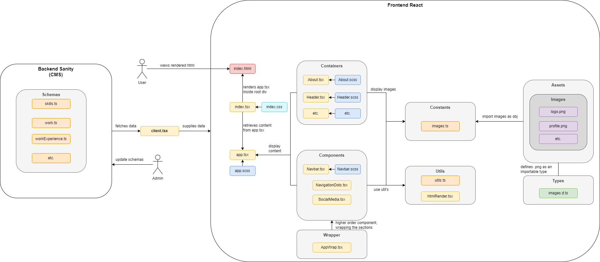

# To Run Website Locally:

1. enter sanity directory via "cd backend_sanity"
2. run sanity via "sanity start"
3. enter react directory via "cd frontend_react"
4. run react via "npm start"

# Flowchart

- Flow chart explaining basic architecture of the app

# CMS

## Sanity CMS

- In `backend_sanity` directory, create a directory 'schemas', then inside of this create TypeScript files for each schema you want to create
  - Schemas are the structure of the data that you want to store in Sanity
    - Essentially simple easy to manage JSON Objects
    
- Run sanity locally: `sanity start` (in `backend_sanity` directory) to start the studio
    - This will start the studio on `http://localhost:3333` and allow you to edit the schema