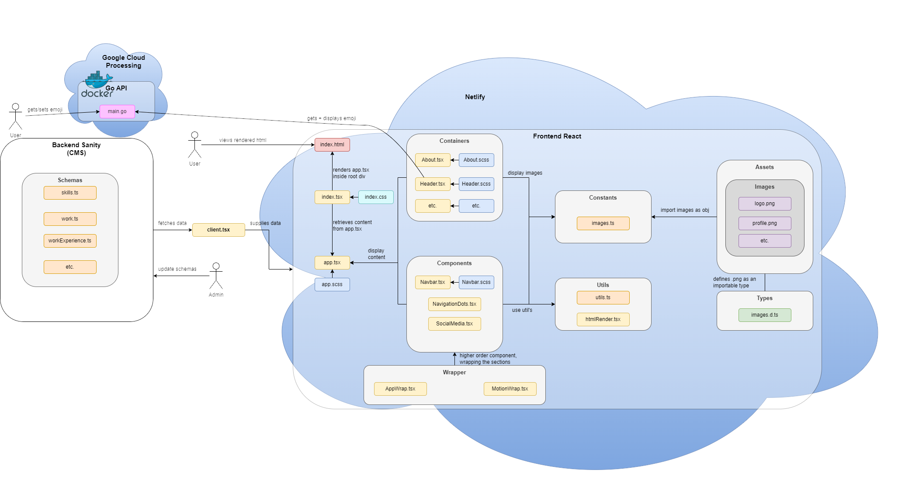

# Flowchart

- Flow chart explaining basic architecture of the app

# To Run Website Locally:

## Automatic 

1. in file-explorer navigate to /_misc/ then run startScript.ps1 to do all of the below automatically
   
## Manual

1. Launch new Powershell Window in /backend_sanity/
2. run sanity via "sanity start"
   1. Hosts on http://localhost:3333
3. Launch new Powershell Window in /frontend_react/
4. run react via "npm start"
   1. Hosts on http://localhost:3000
5. Launch new Powershell Window in /api_go/
6. run go via "go run main.go"
   1. Hosts on http://localhost:8080

# Postman Go API

- Postman collection of sample requests if you would like to interact with it
  - _misc\Portfolio.postman_collection.json